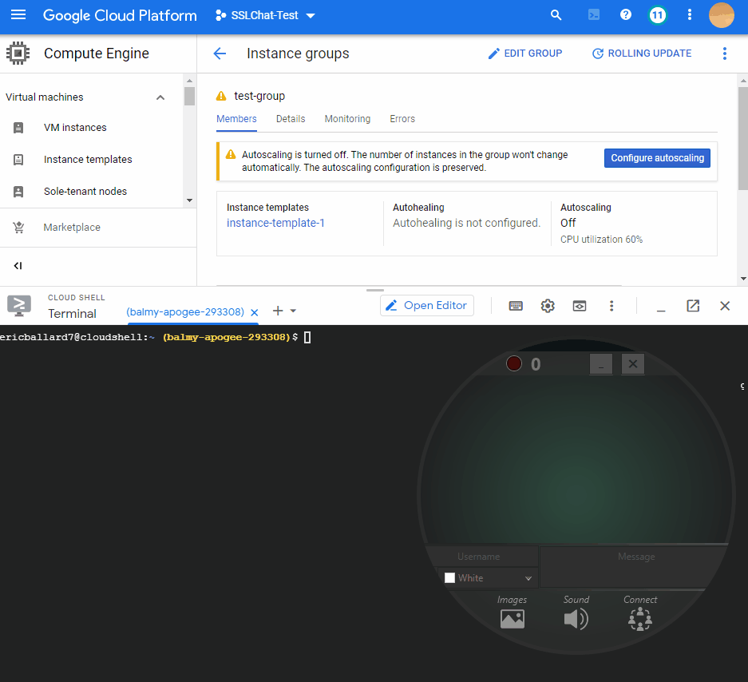

# SSLChat
_A lightweight and secure chat application - bountiful in both form and function! Includes cloud-based simulation-testing._

### Features ###
- Secured by SSL - Host and/or Join a chat server in a standalone portable application
- Configure custom username, name-color, and messages
- Toggable alert sound when receiving a new message
- Displays other users who are typing on server
- Informs number of connected users
- It's a circle

### Configurability ###
- **Username** Enter a unique display name and selected color to highlight
- **Message** Type desired messages and send local jpg and png files to chat
- **Server** Host your server on any port or Join a server at any ip/port combination

### Testng ####

*NOTE:*
_Unable to extensively stress due to GCP quota restriction while using trial credits_

